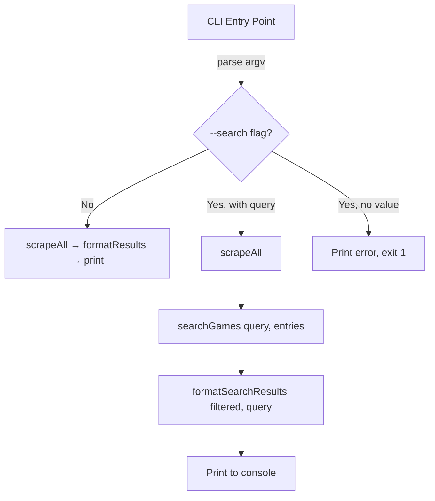

# Design Document: Game Search Command

## Overview

The game search command adds a `--search <query>` CLI flag to the existing NSP web scraper. When provided, the scraper runs its full pipeline (fetch all sources, parse HTML, collect `GameEntry` records) and then filters the collected results to only those whose `gameName` contains the search query as a case-insensitive substring. Filtered results are re-indexed starting from 1 and displayed using the same `cli-table3` table format, with a header line showing the match count and the query used. When no flag is provided, behavior is unchanged.

The implementation touches three areas:

1. **CLI argument parsing** in `src/index.ts` — parse `process.argv` for `--search`.
2. **A new search/filter module** `src/search.ts` — pure function that filters `GameEntry[]` by query.
3. **Formatter additions** in `src/formatter.ts` — a search-specific header and the "no results" message.

No changes are needed to the fetcher, parser, orchestrator, or source-specific parsers.

## Architecture



The search feature is a post-processing step layered on top of the existing pipeline. The scraping pipeline is untouched; only the entry point and output formatting are extended.

## Components and Interfaces

### CLI Argument Parser (in `src/index.ts`)

```typescript
interface CliArgs {
  searchQuery: string | null;
}

function parseArgs(argv: string[]): CliArgs
// Scans argv for "--search". If found, the next element is the query.
// Returns { searchQuery: null } when --search is absent.
// Throws / exits with error when --search is present but no value follows.
```

### Search Module (`src/search.ts`)

```typescript
function searchGames(query: string, entries: GameEntry[]): GameEntry[]
// 1. Trims the query.
// 2. Converts query to lowercase.
// 3. Filters entries where entry.gameName.toLowerCase() includes the lowered query.
// 4. Re-indexes the filtered results starting from 1.
// 5. Returns the new array.
```

This is a pure function with no side effects — easy to test.

### Formatter Additions (`src/formatter.ts`)

```typescript
function formatSearchResults(entries: GameEntry[], query: string, errors: string[]): string
// If entries is empty: returns "No games found matching '<query>'."
// Otherwise: prepends "Found X result(s) for '<query>':" then renders the
// same cli-table3 table as formatResults.
// Appends errors section if any errors exist.
```

## Data Models

No new data types are introduced. The feature reuses the existing `GameEntry` and `Source` interfaces. The only new structure is the internal `CliArgs` object used to pass parsed arguments within `index.ts`.

### Search Flow Data

| Step | Input | Output |
|------|-------|--------|
| Parse CLI args | `process.argv` | `CliArgs { searchQuery }` |
| Scrape all sources | `Source[]` | `{ entries: GameEntry[], errors: string[] }` |
| Filter by query | `(query, GameEntry[])` | `GameEntry[]` (re-indexed) |
| Format output | `(GameEntry[], query, errors)` | `string` (console output) |

### Console Output Format (Search Mode)

When matches exist:
```
Found 3 result(s) for 'zelda':

┌───┬──────────────────────────────────────────────────┬───────────────────┬──────────────────────────────────────────────────────────────────────────────────────┐
│ # │ Game Name                                        │ Source            │ Download URL                                                                       │
├───┼──────────────────────────────────────────────────┼───────────────────┼──────────────────────────────────────────────────────────────────────────────────────┤
│ 1 │ The Legend of Zelda - Tears of the Kingdo...     │ FMHY              │ https://example.com/zelda-totk.nsp                                                 │
│ 2 │ The Legend of Zelda - Breath of the Wild         │ SwitchRom         │ https://example.com/zelda-botw.nsp                                                 │
│ 3 │ Zelda Link's Awakening                           │ NSWTL             │ https://example.com/zelda-la.nsp                                                   │
└───┴──────────────────────────────────────────────────┴───────────────────┴──────────────────────────────────────────────────────────────────────────────────────┘
```

When no matches:
```
No games found matching 'nonexistent game'.
```

## Correctness Properties

*A property is a characteristic or behavior that should hold true across all valid executions of a system — essentially, a formal statement about what the system should do. Properties serve as the bridge between human-readable specifications and machine-verifiable correctness guarantees.*

### Property 1: CLI Argument Parsing Correctness

*For any* non-empty string used as a search query, when `process.argv` contains `--search` followed by that string, `parseArgs` SHALL return a `CliArgs` object with `searchQuery` equal to that string. When `process.argv` does not contain `--search`, `parseArgs` SHALL return `searchQuery` as `null`.

**Validates: Requirements 1.1, 1.2**

### Property 2: Case-Insensitive Substring Filter Correctness

*For any* search query string and *for any* array of `GameEntry` objects, `searchGames(query, entries)` SHALL return exactly those entries where `entry.gameName.toLowerCase()` contains `query.trim().toLowerCase()` as a substring, and SHALL exclude all others.

**Validates: Requirements 2.1, 2.2, 2.3**

### Property 3: Search Output Completeness

*For any* non-empty array of `GameEntry` objects and *for any* search query string, the output of `formatSearchResults(entries, query, errors)` SHALL contain the number of entries, the query string, and for each entry: its `gameName` (or truncated form), `sourceName`, and `downloadUrl` (or truncated form).

**Validates: Requirements 3.1, 3.2**

### Property 4: Sequential Re-Indexing

*For any* array of `GameEntry` objects returned by `searchGames`, the `index` field of the entries SHALL form a sequential sequence starting from 1 (i.e., the k-th entry has `index === k`).

**Validates: Requirements 3.4**

### Property 5: Whitespace Trimming Equivalence

*For any* search query string and *for any* amount of leading/trailing whitespace added to that query, `searchGames(paddedQuery, entries)` SHALL return the same set of entries as `searchGames(trimmedQuery, entries)`.

**Validates: Requirements 4.1**

## Error Handling

| Scenario | Behavior |
|----------|----------|
| `--search` flag with no value | Print error message: "Error: --search requires a search term." Exit with code 1. |
| `--search` with whitespace-only value | Treat as missing value — same error as above. |
| Search query matches zero entries | Display: "No games found matching '\<query\>'." Exit with code 0. |
| Scraping errors during fetch/parse | Handled by existing error pipeline. Errors are collected and displayed below search results if any matches exist. |
| All sources fail, search mode active | Display "No games found matching '\<query\>'." plus the errors section. |

## Testing Strategy

### Unit Tests

Example-based tests for specific scenarios and edge cases:

- `parseArgs`: no flags → null, `--search zelda` → "zelda", `--search` at end → error
- `searchGames`: multi-word query "Mario Bros" matches "Super Mario Bros Wonder"
- `searchGames`: entries from multiple sources all included when matching
- `formatSearchResults`: empty results → "No games found matching '...'" message
- `formatSearchResults`: non-empty results → table with header line

### Property-Based Tests

Property-based tests using `fast-check`, minimum 100 iterations each:

- **Property 1**: CLI argument parsing — generate random query strings, verify parseArgs round-trips correctly
  - Tag: `Feature: game-search-command, Property 1: CLI Argument Parsing Correctness`
- **Property 2**: Filter correctness — generate random entries and queries, verify filter matches case-insensitive substring semantics exactly
  - Tag: `Feature: game-search-command, Property 2: Case-Insensitive Substring Filter Correctness`
- **Property 3**: Output completeness — generate random entries and queries, verify formatted output contains count, query, and all entry data
  - Tag: `Feature: game-search-command, Property 3: Search Output Completeness`
- **Property 4**: Re-indexing — generate random entries, filter, verify indices are 1..n
  - Tag: `Feature: game-search-command, Property 4: Sequential Re-Indexing`
- **Property 5**: Trimming equivalence — generate random queries with whitespace padding, verify identical results
  - Tag: `Feature: game-search-command, Property 5: Whitespace Trimming Equivalence`

### Integration Tests

- End-to-end test: mock sources, run full pipeline with `--search`, verify filtered console output
- No-match test: mock sources, search for non-existent game, verify "no games found" message

### Test Libraries

- **fast-check** — property-based testing (already in devDependencies)
- **vitest** — test runner (already in devDependencies)
- **nock** — HTTP mocking for integration tests (already in devDependencies)
