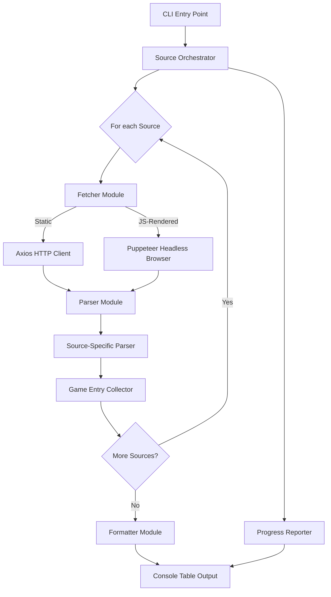

# Design Document: NSP Web Scraper

## Overview

The NSP Web Scraper is a console-based Node.js application that fetches HTML content from six predefined Nintendo Switch ROM source websites, parses each page to extract `.nsp` file links and game names, and displays the aggregated results in a formatted console table. The scraper handles each source independently — if one fails, the rest continue. Some sources may require JavaScript rendering, so the scraper supports both static HTTP fetching and headless browser rendering.

The application is built as a CLI tool using TypeScript, leveraging `axios` for static HTTP requests, `puppeteer` for JS-rendered pages, `cheerio` for HTML parsing, and `cli-table3` for formatted console output.

## Architecture



The architecture follows a pipeline pattern:

1. **CLI Entry Point** — Bootstraps the app, triggers the orchestrator.
2. **Source Orchestrator** — Iterates over all target sources, coordinates fetching and parsing, collects results and errors.
3. **Fetcher Module** — Retrieves HTML content. Uses Axios for static pages and Puppeteer for JS-rendered pages. Enforces a 30-second timeout per request.
4. **Parser Module** — Dispatches to source-specific parsers based on the source URL. Each parser understands the HTML structure of its target site.
5. **Formatter Module** — Takes the collected `GameEntry[]` results and renders a formatted console table with truncation, alignment, and summary stats.
6. **Progress Reporter** — Emits status messages to the console during fetching and parsing phases.

## Components and Interfaces

### Types

```typescript
interface Source {
  url: string;
  name: string;
  requiresJs: boolean;
}

interface GameEntry {
  index: number;
  gameName: string;
  downloadUrl: string;
  sourceName: string;
  sourceUrl: string;
}

interface FetchResult {
  source: Source;
  html: string | null;
  error: string | null;
}

interface ParseResult {
  source: Source;
  entries: GameEntry[];
  message: string | null;
}

```

### Fetcher Module

```typescript
// fetcher.ts
async function fetchSource(source: Source): Promise<FetchResult>
// Routes to fetchStatic or fetchWithBrowser based on source.requiresJs
// Enforces 30s timeout. Returns html on success, error message on failure.

async function fetchStatic(url: string): Promise<string>
// Uses axios with 30s timeout to GET the URL, returns response body HTML.

async function fetchWithBrowser(url: string): Promise<string>
// Launches Puppeteer, navigates to URL, waits for content, returns rendered HTML.
```

### Parser Module

```typescript
// parser.ts
function parseSource(source: Source, html: string): ParseResult
// Dispatches to the correct source-specific parser based on source URL.
// Returns extracted GameEntry[] or a message if no links found.

function extractGameName(linkText: string, url: string): string
// Extracts game name from link text; falls back to filename from URL.

function isNspLink(url: string): boolean
// Returns true if the URL ends with .nsp (case-insensitive) or matches
// known ROM entry patterns for the source.
```

### Source-Specific Parsers

```typescript
// parsers/fmhy.ts
function parseFmhy(html: string): GameEntry[]

// parsers/retrogrados.ts
function parseRetrogrados(html: string): GameEntry[]

// parsers/switchrom.ts
function parseSwitchrom(html: string): GameEntry[]

// parsers/nswtl.ts
function parseNswtl(html: string): GameEntry[]

// parsers/switchRomsOrg.ts
function parseSwitchRomsOrg(html: string): GameEntry[]

// parsers/romenix.ts
function parseRomenix(html: string): GameEntry[]
```

### Formatter Module

```typescript
// formatter.ts
function formatResults(entries: GameEntry[], errors: string[]): string
// Builds the console table string with header, divider, truncated columns,
// per-source breakdown, and total count.

function truncate(text: string, maxLength: number): string
// Truncates text to maxLength and appends "..." if it exceeds the limit.
```

### Progress Reporter

```typescript
// progress.ts
function reportFetching(source: Source): void
function reportParsing(source: Source): void
function reportComplete(): void
```

### Orchestrator

```typescript
// orchestrator.ts
async function scrapeAll(sources: Source[]): Promise<{entries: GameEntry[], errors: string[]}>
// Iterates sources, fetches, parses, collects results. Reports progress.
```

## Data Models

### Source Configuration

Each source is defined as a static configuration object:

```typescript
const TARGET_SOURCES: Source[] = [
  { url: "https://fmhy.net/gamingpiracyguide#nintendo-roms", name: "FMHY", requiresJs: true },
  { url: "https://www.retrogradosgaming.com", name: "RetrogradosGaming", requiresJs: false },
  { url: "https://switchrom.net", name: "SwitchRom", requiresJs: false },
  { url: "https://nswtl.info/", name: "NSWTL", requiresJs: false },
  { url: "https://switch-roms.org", name: "SwitchRomsOrg", requiresJs: false },
  { url: "https://romenix.net/list?system=9&p=1", name: "Romenix", requiresJs: false },
];
```

The `requiresJs` flag determines whether the fetcher uses Axios (static) or Puppeteer (JS-rendered). This can be adjusted per source as needed during development.

### GameEntry

The core data unit flowing through the pipeline:

| Field        | Type   | Description                                    |
|-------------|--------|------------------------------------------------|
| index       | number | Sequential row number for display              |
| gameName    | string | Extracted game title                           |
| downloadUrl | string | Direct download URL for the .nsp file          |
| sourceName  | string | Human-readable source label (e.g., "FMHY")    |
| sourceUrl   | string | The original source URL it was scraped from    |

### Console Output Format

```
Found 142 NSP links across 6 sources:
  FMHY: 23 | RetrogradosGaming: 45 | SwitchRom: 30 | NSWTL: 12 | SwitchRomsOrg: 18 | Romenix: 14

┌───────┬────────────────────────────────────────────────────┬───────────────────┬──────────────────────────────────────────────────────────────────────────────────────┐
│ #     │ Game Name                                          │ Source            │ Download URL                                                                       │
├───────┼────────────────────────────────────────────────────┼───────────────────┼──────────────────────────────────────────────────────────────────────────────────────┤
│ 1     │ The Legend of Zelda - Tears of the Kingdo...       │ FMHY              │ https://example.com/zelda-totk.nsp                                                 │
│ 2     │ Super Mario Bros Wonder                            │ RetrogradosGaming │ https://example.com/smb-wonder.nsp                                                 │
└───────┴────────────────────────────────────────────────────┴───────────────────┴──────────────────────────────────────────────────────────────────────────────────────┘
```


## Correctness Properties

*A property is a characteristic or behavior that should hold true across all valid executions of a system — essentially, a formal statement about what the system should do. Properties serve as the bridge between human-readable specifications and machine-verifiable correctness guarantees.*

### Property 1: NSP Link Detection is Case-Insensitive

*For any* URL string that ends with `.nsp` in any case variation (e.g., `.NSP`, `.Nsp`, `.nSp`), the `isNspLink` function SHALL return `true`. *For any* URL string that does not end with `.nsp` (case-insensitive), the function SHALL return `false`.

**Validates: Requirements 2.2**

### Property 2: GameEntry Completeness

*For any* valid HTML anchor element containing an NSP link, the resulting `GameEntry` SHALL have a non-empty `gameName` (extracted from link text or filename portion of the URL), a non-empty `downloadUrl`, and a non-empty `sourceUrl`.

**Validates: Requirements 2.3, 2.4**

### Property 3: Truncation Correctness

*For any* string and any positive max length, `truncate(text, maxLength)` SHALL return the original string unchanged if its length is ≤ `maxLength`, and SHALL return a string of exactly `maxLength + 3` characters (the first `maxLength` characters followed by `...`) if the original string length exceeds `maxLength`.

**Validates: Requirements 3.4, 3.5**

### Property 4: Formatted Output Contains All Entry Data

*For any* non-empty array of `GameEntry` objects, the formatted console output SHALL contain the `gameName` (or its truncated form), `sourceName`, and `downloadUrl` (or its truncated form) of every entry in the array.

**Validates: Requirements 3.1**

### Property 5: Summary Count Consistency

*For any* array of `GameEntry` objects from multiple sources, the total count displayed in the summary SHALL equal the length of the array, and the sum of all per-source counts SHALL equal the total count.

**Validates: Requirements 3.6**

### Property 6: Error Message Contains Source URL and Status Code

*For any* HTTP error status code (400–599) and any source URL, the generated error message SHALL contain both the source URL string and the numeric status code.

**Validates: Requirements 1.3**

## Error Handling

| Scenario | Behavior |
|----------|----------|
| HTTP non-success status (4xx/5xx) | Log error with source URL and status code, skip source, continue |
| Network timeout (>30s) | Log timeout error identifying the source, skip source, continue |
| Connection failure (DNS, refused) | Log connection error identifying the source, skip source, continue |
| No .nsp links found on a source | Display "no .nsp files found" message for that source, continue |
| No .nsp links found on any source | Display global "no .nsp files found" message, exit gracefully |
| Puppeteer launch failure | Log browser error, fall back to static fetch or skip source |
| Malformed HTML | Cheerio handles gracefully; extract whatever links are parseable |
| Empty response body | Treat as "no links found" for that source |

All errors are non-fatal at the source level. The scraper always attempts all sources and displays whatever results it collected.

## Testing Strategy

### Unit Tests

Unit tests cover specific examples, edge cases, and error conditions:

- `isNspLink` with concrete URLs: `.nsp`, `.NSP`, `.nsp?query`, `.zip`, empty string
- `extractGameName` with known link text and URL patterns
- `truncate` with boundary values: exactly at limit, one over, empty string
- `formatResults` with empty array, single entry, multiple sources
- Error message formatting with specific status codes (404, 500, 503)
- Source-specific parsers with sample HTML snippets from each target site
- Orchestrator behavior when all sources fail vs. partial failure

### Property-Based Tests

Property-based tests verify universal properties using `fast-check`:

- Each property test runs a minimum of 100 iterations
- Each test is tagged with its design property reference
- Tag format: **Feature: nsp-webscraper, Property {number}: {property_text}**

Properties to implement:
1. NSP link detection case-insensitivity (Property 1)
2. GameEntry completeness invariant (Property 2)
3. Truncation correctness at any boundary (Property 3)
4. Formatted output data inclusion (Property 4)
5. Summary count consistency (Property 5)
6. Error message content (Property 6)

### Integration Tests

Integration tests verify end-to-end behavior with mocked HTTP responses:

- Full pipeline test: mock all 6 sources with sample HTML, verify complete output
- Partial failure test: mock some sources as failing, verify remaining results display
- Timeout test: verify 30-second timeout configuration
- JS-rendered source test: verify Puppeteer is invoked for `requiresJs: true` sources

### Test Libraries

- **fast-check** — Property-based testing library for TypeScript
- **vitest** — Test runner
- **nock** or **msw** — HTTP request mocking for integration tests
